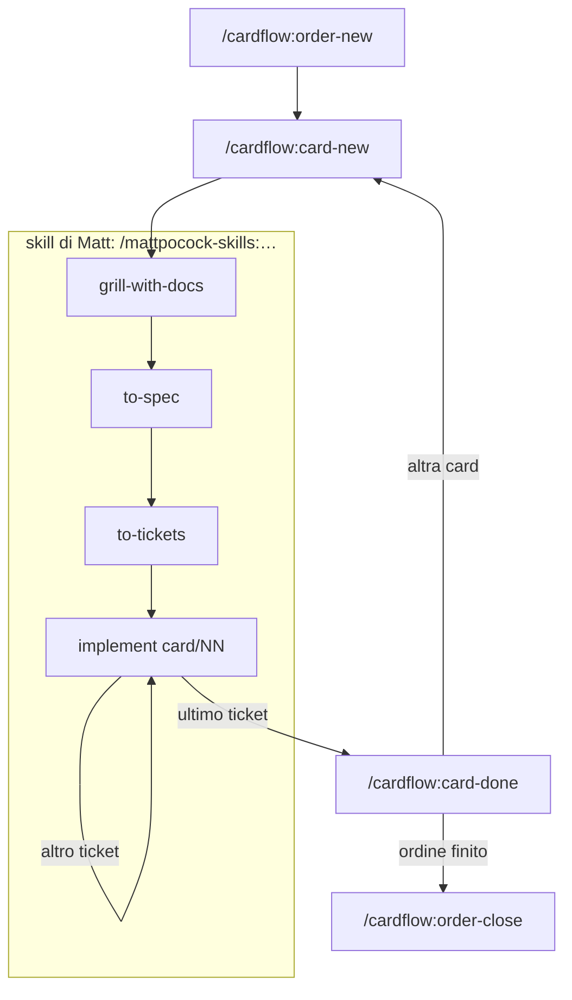

# cardflow

Plugin per Claude Code che organizza lo sviluppo in tre livelli, sopra le skill di Matt Pocock.

| Livello | Che cos'è | Dove sta |
|---|---|---|
| **Progetto** | quello che vale sempre: decisioni, vincoli, migliorie, punti aperti, conoscenza | `.work/project/` |
| **Ordine** | un impegno, cioè una CR o una release: che cosa fare e su quale ramo | `.work/orders/` |
| **Card** | un blocco di sviluppo, su cui lavorano le skill di Matt | `.work/cards/` |

`.work/` sta fuori dal repository del codice, che resta pulito.

Le regole complete sono nel [manuale](manual/overview.md). Dentro Claude Code le riassume `/cardflow:help`.

## Installazione

### Che cosa serve

- Claude Code
- il plugin `mattpocock-skills`, dal marketplace `mattpocock/skills`
- un repository git per il codice

### Installare

```text
/plugin marketplace add ltresoldiTMC/CardFlowPlugin
/plugin install cardflow@cardflow
```

### Aggiornare

```text
/plugin marketplace update cardflow
```

Da VS Code si fa anche dal pannello `/plugins`, scheda *Marketplaces*, con l'icona di aggiornamento accanto a
`cardflow`.

### Configurare un progetto

Lancia `/cardflow:init` dalla cartella in cui lavori con Claude Code: una volta per progetto, e di nuovo dopo ogni
aggiornamento del plugin.

Ti chiede:

- se i file per l'IA stanno nel repository o in una cartella `.ai/` separata;
- dove sta il repository;
- dove mettere `.work/`.

Poi scrive:

- i permessi e le cartelle di `.work/`;
- la configurazione delle skill di Matt, in `docs/agents/`;
- un blocco di regole nel `CLAUDE.md`.

Se trova `superpowers` installato, lo spegne nel progetto. Se lo rilanci, non cambia nulla.

## Come si lavora



### 1. Apri un ordine

```text
/cardflow:order-new CR0412
```

- Ti chiede titolo, ramo e criteri di accettazione.
- Senza numero di CR, l'Id lo genera il plugin.

### 2. Crea una card

```text
/cardflow:card-new
```

- Ti chiede titolo, priorità, ordine e due righe sull'idea.
- L'Id lo genera il plugin, per esempio `26258KD`: anno, giorno dell'anno e ora in lettere. Le card si ordinano da
  sole.
- Senza ordine la card resta nel backlog: puoi farne il grilling, non la spec.

### 3. Grilling, spec e ticket

Nella stessa conversazione:

```text
/mattpocock-skills:grill-with-docs
/mattpocock-skills:to-spec
/mattpocock-skills:to-tickets
/clear
```

### 4. Un ticket per conversazione

```text
/mattpocock-skills:implement 26258KD/01
/clear
```

- **Prima di cominciare**, l'agente ti avvisa se un bloccante è ancora aperto o se sei su un ramo diverso da quello
  dell'ordine.
- **Alla fine** rivede il lavoro e annota in fondo alla spec dove si è discostato.
- **Il commit lo fai tu.** L'agente ti propone una riga in inglese; quando gli dici che hai committato, cancella il
  ticket.

### 5. Chiudi la card

Dopo l'ultimo ticket l'agente chiede «Procediamo con la review e chiudiamo?». Se rispondi sì, parte:

```text
/cardflow:card-done 26258KD
```

- Un agente rivede la card intera contro la spec.
- Tu scegli che cosa correggere e confermi che cosa sale nei registri.
- La card finisce nell'archivio dell'ordine, con un handover per te.

### 6. Chiudi l'ordine

```text
/cardflow:order-close CR0412
```

- Verifica i criteri di accettazione.
- Ti chiede che cosa fare delle card rimaste.
- Porta i registri dell'ordine nel progetto.

## A che punto sei

Due comandi rispondono a «dove siamo?». Puoi anche chiederlo a parole: «che card ci sono?», «dimmi i punti
aperti».

### Le card: `/cardflow:card-list`

Elenca le card aperte, prima quelle in corso e poi quelle nel backlog, ciascuna in ordine di priorità.

Un esempio di che cosa stampa:

| Id | Titolo | Stato | Priorità | Ordine | Ramo | Bloccanti | Ticket |
|---|---|---|---|---|---|---|---|
| `26258KD` | Esportazione in PDF | `DOING` | alta | `CR0412` | `cr0412-invoices` | | 2 |
| `26261BM` | Invio delle fatture per email | `BACKLOG` | media | `CR0412` | `cr0412-invoices` | `C3` | 0 |
| `26263QF` | Pulizia dell'archivio | `BACKLOG` | bassa | | | | 0 |

- **Bloccanti**: i codici delle voci di registro che tengono ferma la card e non sono ancora risolte.
- **Ticket**: quanti ne restano da fare.
- **Ramo**: se una card in corso sta su un ramo diverso da quello attivo, il comando lo segnala.
- Le card chiuse non compaiono: stanno nell'archivio del loro ordine.

### I punti aperti: `/cardflow:open-points`

```text
/cardflow:open-points              tutti i punti aperti del progetto
/cardflow:open-points CR0412       quelli di un ordine e delle sue card
/cardflow:open-points 26261BM      quelli di una card, compresi quelli che la bloccano
```

Un esempio di che cosa stampa:

| Codice | Titolo | Livello | Tipo | Tiene ferme |
|---|---|---|---|---|
| `C3` | Formato delle date accettato dal gestionale | ordine `CR0412` | cliente | `26261BM` |
| `T4` | Smoke a schermo non eseguito | ordine `CR0412` | tecnico | |
| `T2` | Timeout della connessione al database | progetto | tecnico | |
| | Colonne da escludere nel PDF | card `26258KD` | tecnico | |

- **Prima i bloccanti**: le voci che tengono ferma una card o che dicono di bloccare.
- **Livello**: il file in cui la voce sta adesso, cioè progetto, ordine o card.
- I punti di una card non hanno codice: lo prendono quando salgono all'ordine, alla chiusura della card.
- In fondo il comando segnala le card con bloccanti già risolti, che puoi riprendere, e i riferimenti da
  correggere.

### Annotare un punto aperto

- **Durante il lavoro su una card** l'agente lo annota da sé, nella card.
- **Fuori da una card** chiedilo: «annota come punto aperto: …».
- **Se una card aspetta una risposta**, scrivilo nella sua intestazione, con codice e titolo:

  ```text
  Blocked by: C3 (formato delle date accettato dal gestionale)
  ```

  Quando la voce si risolve e sparisce dal registro, la card si sblocca da sola.

## Id e riferimenti

| Che cosa | Forma | Esempio |
|---|---|---|
| ordine | numero della CR o della release, oppure generato | `CR0412` |
| card | generato: anno, giorno dell'anno, ora in lettere | `26258KD` |
| ticket | Id della card e numero del ticket | `26258KD/01` |
| voce di registro | lettera e numero: `T` tecnico, `C` cliente, `D` decisione | `C3` |

- Nei comandi puoi passare l'Id oppure il nome intero della cartella: `26258KD` o `26258KD-pdf-export`.
- Nei documenti l'Id va con il titolo: «`26258KD` (esportazione in PDF)».

Come nascono gli Id e perché sono fatti così: [manual/identifiers.md](manual/identifiers.md).

## Comandi

| Comando | Che cosa fa |
|---|---|
| `/cardflow:init` | configura il progetto |
| `/cardflow:help [argomento]` | riassume il metodo, o risponde su un tema |
| `/cardflow:order-new [order-id]` | apre un ordine |
| `/cardflow:order-close <order-id>` | chiude un ordine |
| `/cardflow:card-new [card-id]` | crea una card |
| `/cardflow:card-list` | elenca le card aperte |
| `/cardflow:card-assign <card-id> <order-id>` | assegna a un ordine una card del backlog; con `-` la toglie |
| `/cardflow:card-done <card-id>` | chiude una card |
| `/cardflow:open-points [order-id \| card-id]` | elenca i punti aperti |
