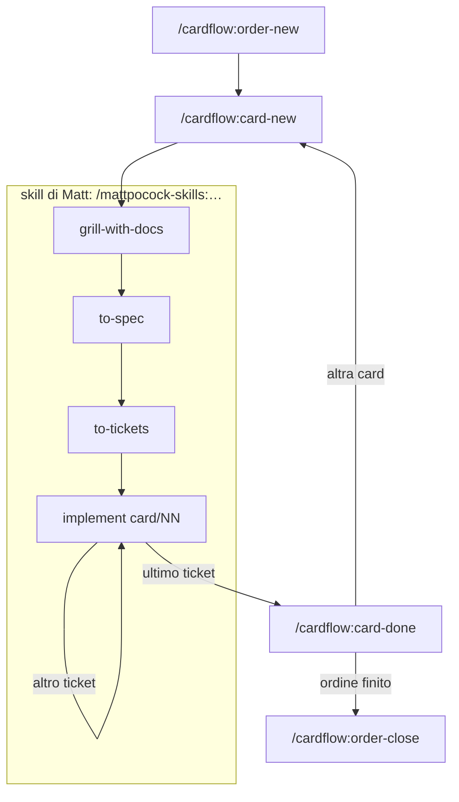

# cardflow

Plugin per Claude Code che organizza lo sviluppo in tre livelli. Il progetto conserva quello che vale sempre;
l'ordine, cioè una CR o una release, dice che cosa fare e su quale ramo; la card è un blocco di sviluppo, su cui
lavorano le skill di Matt Pocock. I dati di lavoro stanno in `.work/`, fuori dal repository del codice.

Le regole complete sono in [`manual/overview.md`](manual/overview.md); dentro Claude Code le riassume
`/cardflow:help`.

## Installazione

Ti servono il plugin `mattpocock-skills`, dal marketplace `mattpocock/skills`, e un repository git per il codice.
Poi:

```text
/plugin marketplace add ltresoldiTMC/CardFlowPlugin
/plugin install cardflow@cardflow
```

Per aggiornarlo lanci `/plugin marketplace update cardflow`.

In ogni progetto lancia `/cardflow:init` dalla cartella in cui lavori con Claude Code, una volta e poi dopo ogni
aggiornamento del plugin. Ti chiede se i file per l'IA stanno nel repository o in una cartella `.ai/` separata, dove
sta il repository e dove mettere `.work/`. Poi scrive permessi, cartelle, la configurazione delle skill di Matt e un
blocco di regole nel `CLAUDE.md`, e spegne `superpowers` nel progetto se lo trova installato. Se lo rilanci, non
cambia nulla.

## Come si lavora



1. `/cardflow:order-new` apre un ordine con Id, titolo, ramo e criteri di accettazione.
2. `/cardflow:card-new` crea una card. Senza ordine resta nel backlog: puoi farne il grilling, non la spec.
3. Nella stessa conversazione lanci `/mattpocock-skills:grill-with-docs`, `/mattpocock-skills:to-spec` e
   `/mattpocock-skills:to-tickets`, poi `/clear`.
4. Implementi un ticket per conversazione con `/mattpocock-skills:implement 260916/01`, poi `/clear`. Prima di
   cominciare l'agente ti avvisa se un bloccante è ancora aperto o se sei su un ramo diverso da quello dell'ordine.
   Alla fine rivede il lavoro, annota in fondo alla spec dove si è discostato e ti propone una riga di commit in
   inglese. Il commit lo fai tu; quando glielo dici, cancella il ticket.
5. Dopo l'ultimo ticket l'agente chiede «Procediamo con la review e chiudiamo?». Se rispondi sì, parte
   `/cardflow:card-done 260916`: un agente rivede la card intera, tu scegli che cosa correggere e confermi che cosa
   sale nei registri, e la card finisce nell'archivio dell'ordine con un handover.
6. `/cardflow:order-close CR0412` verifica i criteri, ti chiede che cosa fare delle card rimaste e porta i registri
   nel progetto.

In qualunque momento `/cardflow:card-list` elenca le card aperte, e `/cardflow:card-assign <card-id> <order-id>`
assegna a un ordine una card ancora nel backlog.
