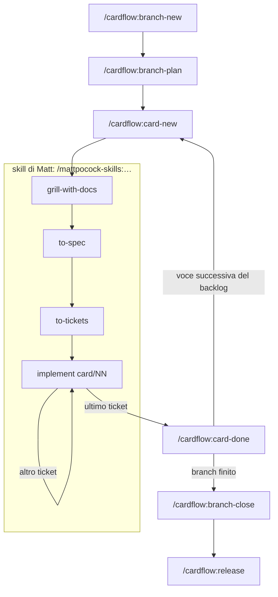

# cardflow

Plugin per Claude Code che organizza lo sviluppo di un progetto, sopra le skill di Matt Pocock. Divide il lavoro in
quattro blocchi, fuori dal repository, e tiene nel repository quello che serve a chi mantiene il codice.

| Dove | Che cosa contiene | Chi lo legge |
|---|---|---|
| **documenti del repository** | architettura, glossario, decisioni, vincoli: seguono il branch con git | l'agente, sempre, e chi mantiene il codice |
| `.work/knowledge/` | il materiale che arriva da fuori: documenti di altri, risorse, analisi | l'agente, quando serve |
| `.work/development/` | una cartella per branch: la spec, il backlog, la card in corso | l'agente, solo quella del branch attivo |
| `.work/control/` | il diario, i punti aperti, le domande, le migliorie | l'operatore; l'agente alle chiusure |
| `.work/deploy/` | gli handover e le consegne | l'operatore e chi installa |

`.work/` sta fuori dal repository e non segue i branch: ne esiste una copia sola.

Le regole complete sono nel [manuale](manual/overview.md). Dentro Claude Code le riassume `/cardflow:help`.

## Installazione

### Che cosa serve

- Claude Code
- il plugin `mattpocock-skills`, dal marketplace `mattpocock/skills`
- un repository git per il codice, con un branch principale

### Installare

```text
/plugin marketplace add ltresoldiTMC/CardFlowPlugin
/plugin install cardflow@cardflow
```

### Aggiornare

```text
/plugin marketplace update cardflow
```

Da VS Code si fa anche dal pannello `/plugins`, scheda *Marketplaces*, con l'icona di aggiornamento accanto a
`cardflow`.

### Configurare un progetto

Lancia `/cardflow:init` dalla cartella in cui lavori con Claude Code: una volta per progetto, e di nuovo dopo ogni
aggiornamento del plugin.

Ti chiede:

- se i file per l'IA stanno nel repository o in una cartella `.ai/` separata;
- dove sta il repository, e qual è il branch principale;
- la lingua dei documenti del repository e i loro percorsi, per default sotto `docs/`;
- dove mettere `.work/`.

Poi scrive i permessi, la configurazione delle skill di Matt in `docs/agents/` e un blocco di regole nel `CLAUDE.md`.
Non crea cartelle in `.work/`: ogni documento nasce quando c'è qualcosa da metterci. Se trova `superpowers` installato,
lo spegne nel progetto. Se trova la struttura della v1, si ferma: la migrazione è una procedura a parte. Se lo rilanci,
non cambia nulla.

## Come si lavora


```mermaid
flowchart TD
    B["/cardflow:branch-new"] --> P["/cardflow:branch-plan"] --> C["/cardflow:card-new"]
    C --> G
    subgraph M["skill di Matt: /mattpocock-skills:…"]
        G["grill-with-docs"] --> S["to-spec"] --> T["to-tickets"] --> I["implement card/NN"]
    end
    I -->|altro ticket| I
    I -->|ultimo ticket| D["/cardflow:card-done"]
    D -->|voce successiva del backlog| C
    D -->|branch finito| X["/cardflow:branch-close"]
    X --> R["/cardflow:release"]
```

Sul branch principale si comincia da `/cardflow:branch-plan`, se la spec della prossima versione c'è, oppure
direttamente da `/cardflow:card-new`. In qualunque momento, `/cardflow:journal`
annota un fatto arrivato da fuori, e `/cardflow:status` dice a che punto sei.

### 1. Apri un branch

Crea il branch in git, poi:

```text
/cardflow:branch-new feature/cr0412-invoices
```

- Ti chiede titolo, obiettivo, perimetro e criteri di accettazione, divisi fra *per il cliente* e *interni*.
- Sul branch principale scrive che cosa deve fare la prossima versione.

### 2. Pianifica il backlog

```text
/cardflow:branch-plan
```

- Legge la spec del branch e ti propone le card da creare, in ordine, ciascuna con i criteri che copre e i suoi
  bloccanti.
- Ti mostra quali criteri restano scoperti.
- Scrive `backlog.md` solo dopo che hai approvato la grana, l'ordine e le voci. Si rilancia quando la spec cambia.

Le cose da fare stanno in `backlog.md`, nella cartella del branch: una voce per sviluppo, la prima è la prossima.

```markdown
## Esportazione in PDF

Ogni fattura esportata arriva al gestionale anche in PDF, allegata alla registrazione.

- **Bloccato da:** Q26255Kb (formato delle date accettato dal gestionale)
```

Puoi anche scriverlo a mano, o chiedere all'agente: «aggiungi al backlog: …».

### 3. Apri la card

```text
/cardflow:card-new
```

- Prende una voce del backlog, di solito la prima, e la toglie dal backlog.
- L'Id lo genera il plugin, per esempio `26258KD`: anno, giorno dell'anno e ora in lettere. Se viene da fuori, lo
  passi tu: `/cardflow:card-new main CR2606`.
- Un branch ha al massimo una card aperta.

### 4. Grilling, spec e ticket

Nella stessa conversazione:

```text
/mattpocock-skills:grill-with-docs
/mattpocock-skills:to-spec
/mattpocock-skills:to-tickets
/clear
```

### 5. Un ticket per conversazione

```text
/mattpocock-skills:implement 26258KD/01
/clear
```

- **Prima di cominciare**, l'agente ti avvisa se un bloccante è ancora aperto o se sei su un branch diverso da quello
  della card.
- **Alla fine** rivede il lavoro, annota in fondo alla spec dove si è discostato, e scrive i passi di installazione
  manuali, se ce ne sono.
- **Il commit lo fai tu.** L'agente ti propone una riga in inglese; quando gli dici che hai committato, cancella il
  ticket.

### 6. Chiudi la card

Dopo l'ultimo ticket l'agente chiede «Procediamo con la review e chiudiamo?». Se rispondi sì, parte:

```text
/cardflow:card-done
```

- Un agente rivede la card intera contro la spec.
- Tu scegli che cosa correggere e confermi, voce per voce, che cosa entra nei documenti del repository e nei
  registri.
- L'handover va in attesa: sul branch principale in `deploy/handovers/pending/`, altrimenti nella cartella del
  branch.
- Il diario riceve una voce, e la cartella della card si cancella.

Se ti blocchi a metà, chiudi la card con quello che c'è: la parte non fatta torna nel backlog, con il suo bloccante.

### 7. Chiudi il branch

```text
/cardflow:branch-close feature/cr0412-invoices
```

- **Prima del merge** verifica i criteri e ti prepara il testo della pull request.
- **Dopo il merge**, rilanciato, porta i punti tecnici, il backlog, gli handover e il riepilogo del branch dove è
  andato il codice, e cancella la cartella. I documenti del repository li ha già uniti git.

### 8. Abbandona un branch

```text
/cardflow:branch-drop feature/prova
```

Per un branch il cui codice non entrerà da nessuna parte: non sale niente. Ti chiede che cosa fare della card e del
backlog, e dei riferimenti al branch nel controllo.

### 9. Rilascia

```text
/cardflow:release
```

Dal branch principale:

- ti mostra gli handover in attesa, ciascuno con il suo tipo (funzione, correzione, incompatibile);
- ti chiede la versione, e ti aiuta con i tipi, la versione precedente e i tag esistenti;
- crea `deploy/releases/<versione>/` con le note di rilascio, i passi di installazione e gli script SQL;
- ti stampa il comando per il tag, che crei tu.

## Annotare un fatto

Quando arriva una risposta del cliente, una mail o l'esito di un incontro:

```text
/cardflow:journal il cliente conferma che il gestionale accetta le date in formato ISO
```

Il comando scrive la voce nel diario e ti propone, una per una, le modifiche che ne seguono: la domanda che si chiude,
il vincolo o la decisione da scrivere, la voce di backlog che si sblocca.

## A che punto sei

Puoi anche chiederlo a parole: «a che punto siamo?», «dimmi i punti aperti».

### Un branch: `/cardflow:status`

Per ogni criterio della spec del branch dice se è soddisfatto, parziale o mancante, e da che cosa lo ricava; poi i
bloccanti, la card in corso e il backlog. Non scrive niente.

### I punti aperti: `/cardflow:open-points`

```text
/cardflow:open-points                              tutti i punti aperti
/cardflow:open-points feature/cr0412-invoices      quelli di un branch
/cardflow:open-points 26261BM                      quelli di una card, compresi quelli che la bloccano
```

Un esempio di che cosa stampa:

| Codice | Titolo | Dove | Tipo | Tiene fermo |
|---|---|---|---|---|
| `Q26255Kb` | Formato delle date accettato dal gestionale | comune | domanda | backlog di `main`: Esportazione in PDF |
| `T26280Mc` | Paginazione dell'esportazione XML | branch `feature/cr0412-invoices` | tecnico | card `26285HT` |
| `T26270Bb` | Timeout della connessione al gestionale | comune, chiuso in `feature/cr0412-invoices` | tecnico | |
| | Colonne da escludere nel PDF | card `26285HT` | tecnico | |

## Solo l'essenziale

Una voce entra in un registro o in un documento solo se supera la prova del suo tipo, per esempio:

- **una decisione**, se un agente che legge solo il codice proporrebbe di rifarlo in un altro modo; il motivo di un
  singolo pezzo di codice va invece in un commento accanto al codice;
- **un punto tecnico**, se è qualcosa che non sappiamo o non abbiamo deciso; un lavoro da fare è una voce del backlog;
- **un termine**, se si confonde o ha un significato suo nel progetto.

La tabella completa è nel [manuale](manual/overview.md), sezione *Solo l'essenziale*.

## Id e riferimenti

| Che cosa | Forma | Esempio |
|---|---|---|
| card | generato: anno, giorno dell'anno, ora in lettere; oppure dato da fuori | `26258KD` |
| ticket | Id della card e numero del ticket | `26258KD/01` |
| punto tecnico, domanda | `T` o `Q`, anno, giorno dell'anno, ora in lettere | `Q26255Kb` |
| miglioria | `MP` di prodotto o `MS` di sistema, poi come sopra | `MP26272Kb` |
| decisione, vincolo, termine | il titolo | «Export writes CSV files to a shared folder» |

- Nei documenti un Id o un codice va con il titolo: «`Q26255Kb` (formato delle date accettato dal gestionale)».
- Nei codici le maiuscole contano: `Q26255Kb` e `Q26255KB` sono due codici diversi.
- Id e codici li genera lo script del plugin, mai l'agente a mente.

Come nascono e perché sono fatti così: [manual/identifiers.md](manual/identifiers.md).

## Comandi

| Comando | Che cosa fa |
|---|---|
| `/cardflow:init` | configura il progetto |
| `/cardflow:help [argomento]` | riassume il metodo, o risponde su un tema |
| `/cardflow:branch-new <branch>` | apre un branch con la sua spec |
| `/cardflow:branch-plan [branch]` | propone il backlog dalla spec: le card da creare |
| `/cardflow:card-new [branch] [id]` | apre la card del branch, da una voce del backlog |
| `/cardflow:card-done [card]` | chiude la card |
| `/cardflow:branch-close <branch>` | prima del merge prepara la pull request; dopo il merge chiude il branch |
| `/cardflow:branch-drop <branch>` | abbandona un branch |
| `/cardflow:open-points [branch \| card]` | elenca i punti aperti |
| `/cardflow:journal [fatto]` | annota un fatto nel diario e ne propone gli effetti |
| `/cardflow:status [branch]` | dice a che punto è un branch |
| `/cardflow:release` | crea la consegna di una versione |
