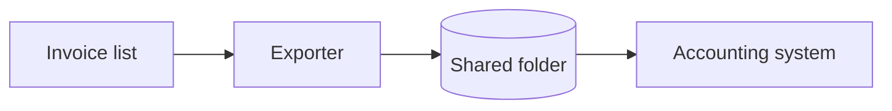

# Documenti di dominio

Come le skill di ingegneria consumano la documentazione di dominio di questo progetto. Il layout è single-context, ma
**non usa `CONTEXT.md` né `docs/adr/`**: il glossario e le decisioni sono due dei quattro documenti del repository
che cardflow mantiene, accanto all'architettura e ai vincoli. I loro percorsi e la loro lingua stanno nel blocco
cardflow del `CLAUDE.md`. La radice di `.work/` si legge da `.WORKDIR`, come dice `issue-tracker.md`; qui si chiama
`<work>`.

**Non creare mai `CONTEXT.md` né `docs/adr/`**, nemmeno quando `/mattpocock-skills:domain-modeling` o
`/mattpocock-skills:grill-with-docs` lo propongono.

## Prima di esplorare, leggi questi

- **Il glossario** del repository, al posto di `CONTEXT.md`.
- **Le decisioni** del repository, al posto di `docs/adr/`.
- **I vincoli** del repository: i fatti che non abbiamo scelto.
- **L'architettura** del repository, quando la domanda riguarda la forma del sistema.
- **`<work>/knowledge/`**, quando la domanda riguarda un sistema esterno: le analisi, e i documenti di altri in
  `docs/`.

Per sapere che cosa è ancora aperto: `<work>/control/open-points-technical.md`, `<work>/control/open-points-client.md`,
il `open-points-technical.md` della cartella del branch e l'`OPEN-POINTS.md` della card. Aperto e deciso non sono
intercambiabili: proporre come aperta una cosa già decisa riapre discussioni chiuse.

Se uno di questi file non esiste, procedi in silenzio.

## Durante un grilling non si scrive nei documenti

I documenti del repository e i registri si aggiornano alla chiusura della card. Quello che emerge in un grilling resta
nella card su cui si sta lavorando:

| Emerge | Dove va durante il lavoro |
|---|---|
| un termine nuovo o precisato | la spec della card; prima che la spec esista, `.scratch/` |
| una decisione | la spec della card; prima che la spec esista, `.scratch/` |
| un vincolo o un fatto esterno | `.scratch/` della card |
| una domanda senza risposta | `OPEN-POINTS.md` della card: una voce `### <titolo>` e qualche riga se serve, senza codice |
| una miglioria | `.scratch/` della card |

Alla chiusura della card, `/cardflow:card-done` propone di portarli al loro posto, uno per uno. Una risposta del
cliente che arriva mentre si lavora si registra con `/cardflow:journal`.

## Solo l'essenziale

- **Una decisione** entra solo se un agente, leggendo solo il codice, proporrebbe di rifarlo in un altro modo. Dice
  che cosa è stato scartato e perché, perché il codice da solo non basta a capirla, e fino a quando vale. Una scelta
  che spiega un solo pezzo di codice va in un commento accanto al codice, non nelle decisioni. È lo stesso filtro con
  cui `/mattpocock-skills:domain-modeling` decide se proporre un ADR, detto con altre parole.
- **Un termine** entra solo se si confonde, o se nel progetto ha un significato suo.
- **Un vincolo** è un fatto imposto da fuori, con chi lo impone e che cosa lo farebbe cadere. Le sue conseguenze sul
  nostro disegno stanno nelle decisioni.
- **L'architettura** dice il minimo che il codice non mostra: i componenti e come si parlano, i flussi principali, i
  sistemi esterni.

## La forma dei documenti del repository

Si scrivono come li scriverebbe una persona del team: chiari, brevi, senza frasi fatte, nella lingua e con le
convenzioni del repository, etichette comprese. Non citano mai `.work`: niente codici di punti aperti o migliorie,
niente Id di card, niente percorsi. Il motivo si scrive per esteso, come in un commento del codice. Decisioni, vincoli
e termini si citano per titolo.

Una voce è un titolo `##` seguito da poche righe. Una voce superata si riscrive al suo posto: una decisione superata
porta la scelta vecchia fra quelle scartate, con il motivo per cui era sbagliata; un vincolo cambiato o un termine che
cambia significato si riscrivono. Una decisione che non vale più e un vincolo caduto si cancellano. Mai due voci
contrapposte: la storia la tiene git.

Le etichette, in italiano e in inglese:

| Italiano | Inglese |
|---|---|
| Origine | Origin |
| Da evitare | Avoid |
| Scelta | Chosen |
| Scartato | Rejected |
| Perché il codice non basta | Why the code is not enough |
| Vale finché | Valid until |

L'origine vale `progetto`, `cliente`, `norma`, `fornitore` o `legacy` (in inglese `project`, `client`, `standard`,
`supplier`, `legacy`). Un vincolo non è mai `progetto`, perché non l'abbiamo scelto noi. Una decisione porta l'origine
solo quando la scelta l'ha fatta il committente.

Gli esempi che seguono sono per un repository in inglese.

**Il glossario:**

~~~markdown
## Registration
Origin: client
The record the accounting system creates for each imported invoice. One invoice can produce more than one.
Avoid: entry, posting
~~~

**Le decisioni:**

~~~markdown
## Export writes CSV files to a shared folder
2026-09-12
Chosen: the export writes one CSV file per batch into a folder that the accounting system watches.
Rejected: the accounting system's API, because the customer's installation has no API module (see the constraint
"No API module").
Why the code is not enough: the code shows the CSV writer, not the API it replaces.
Valid until: the API module becomes available.
~~~

**I vincoli:**

~~~markdown
## No API module
Origin: supplier
The accounting system is installed without its API module, so data can enter only through the file import. It would
fall if the customer bought the module.
~~~

**L'architettura** ha le sezioni che servono al progetto, e i diagrammi in Mermaid dentro il file:

~~~markdown
## Export flow

The exporter runs on the user's workstation; the accounting system imports the folder every five minutes.
~~~

## Usa il vocabolario del glossario

Quando nomini un concetto di dominio, in un ticket, in una proposta o nel nome di una classe, usa il termine come
lo definisce il glossario. Un concetto che manca è un segnale: o stai inventando un linguaggio che il progetto
non usa, o c'è una lacuna da annotare nella card.

## Nel codice il vocabolario sì, i codici no

Un commento non cita mai un punto aperto, una miglioria, una card o un ticket per codice: dice per esteso il motivo,
la trappola o il vincolo, per chi legge il codice senza accesso a `.work/`.

## Segnala i conflitti

Se quello che proponi contraddice una decisione in vigore, dillo invece di scavalcarla:

> _Contraddice la decisione «Export writes CSV files to a shared folder», ma vale la pena riaprirla perché…_

Una decisione non contraddice un vincolo: se quello che proponi lo richiede, dillo, perché prima va cambiato il vincolo
con chi lo impone.
